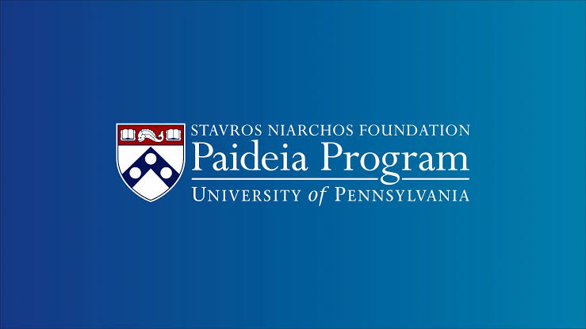
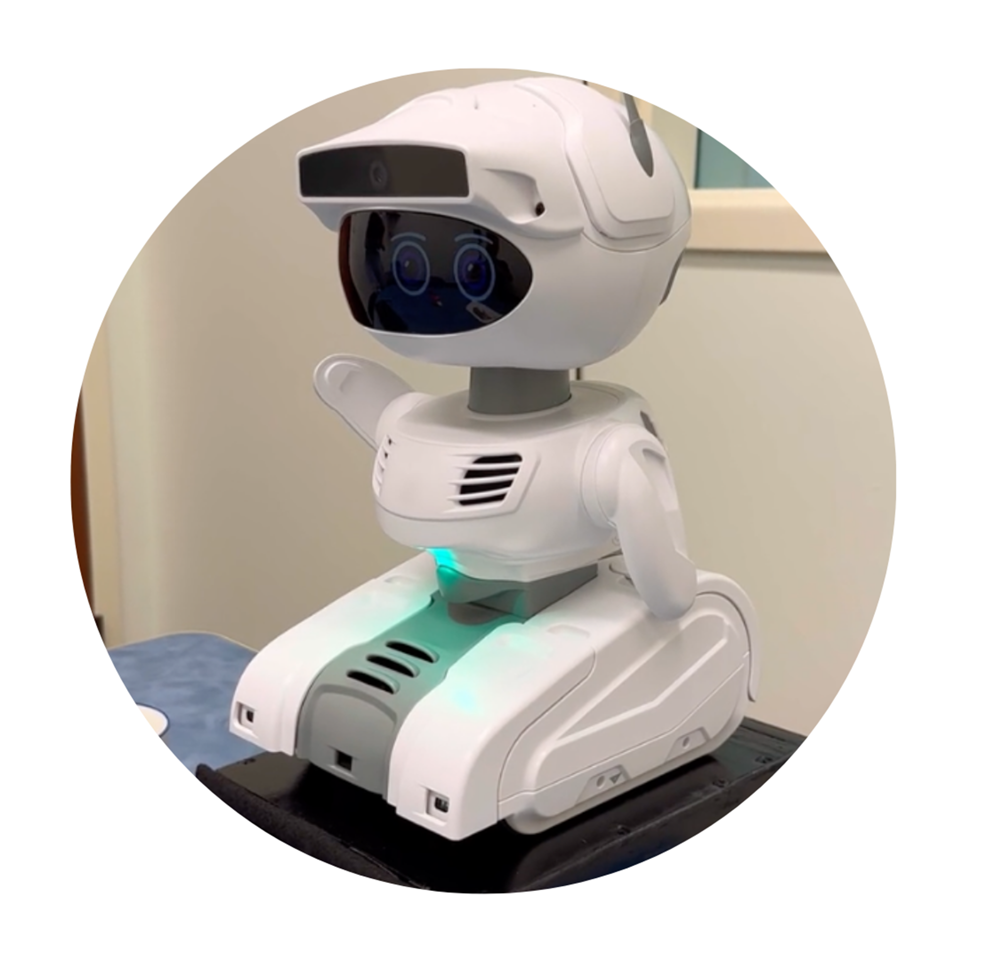
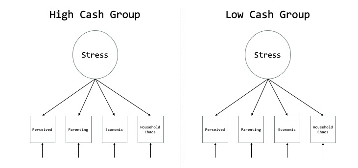
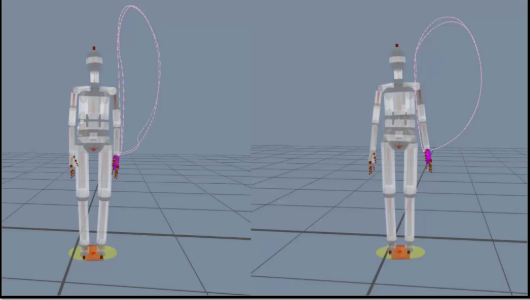

Here you can find more detail about my ongoing and previous work. Please [reach out](mailto:alanger@sas.upenn.edu) if you have any questions!

## Adolescents and AI Chatbots

::: {layout="[1, 3]" layout-valign="center"}
{width="150px"}

I'm currently an [SNF Paideia-Provost Postdoctoral Fellow](https://snfpaideia.upenn.edu/people/allison-langer/) at the University of Pennsylvania, where I study how children's and adolescents' interactions with emerging technologies influence their development and well-being. At Penn, I'm examining how individual differences shape teens' use of artificial intelligence (AI) chatbots, and how AI-literacy-based interventions may encourage adaptive use.

I'm committed to translating research on digital media use into evidence-based resources for policymakers, educators, and families. I recently completed an Impact Fellowship at [Children and Screens: Institute of Digital Media and Child Development](https://www.childrenandscreens.org/), and I contribute to the International Research-driven Alliance for AI Serving Every Child (iRAISE) coalition to promote developmentally aligned AI innovation and governance.
:::

## Smartphone and Social Media Use Across Development

::: {layout="[1, 3]" layout-valign="center"}
{width="150px"}

My dissertation examined how smartphone and social media use relate to the development of self-regulatory control from childhood through adolescence, using behavioral and neuroimaging (fMRI) data. Results from node-wise fMRI and DTI analyses were presented at Flux: The Society for Developmental Cognitive Neuroscience in 2026.
:::

## Human-Computer Interaction

::: {layout="[1, 3]" layout-valign="center"}
{width="150px"}

In collaboration with the [Development and Experience Center](https://www.dax.fandm.edu/) at Franklin & Marshall College, we've investigated how children learn from social robots (see our article in [*Scientific Reports*](LINK) and a news story about the collaboration [here](https://www.fandm.edu/stories/child-robot-research-merges-psychology-and-computer-science.html)). We've also examined how children perceive text and images generated by artificial intelligence. This work received the 2025 Award for Excellence in Science at the Digital Media and Developing Minds International Scientific Congress and is now published in [*Technology in Society*](LINK).
:::

## Stakeholder Research

::: {layout="[1, 3]" layout-valign="center"}
{width="150px"}

Developers have proposed incorporating social technologies into classrooms to provide adaptive learning tools for students. We worked with teachers in the School District of Philadelphia to understand their thoughts, fears, and impressions of using such tools in their classrooms. I presented the results from this study at the American Educational Research Association Annual Meeting in 2024. See the slides [here](files/Langer_AERA_2024.pdf).
:::

## Quantitative Methods

::: {layout="[1, 3]" layout-valign="center"}
{width="150px"}

Using data from the [Baby's First Years Project](https://www.babysfirstyears.com/), I used different quantitative methods to investigate stress among mothers enrolled in the study. I presented a [hierarchical linear model](files/LangerSSHDPoster.pdf) at the Society for the Study of Human Development conference in 2023, and a subsequent [structural equation model](https://rpubs.com/allisonlanger/1178499) on RPubs in 2024.
:::

## Technology as a Scalable Diagnostic Tool

::: {layout="[1, 3]" layout-valign="center"}
{width="150px"}

This work examines how technology, such as motion tracking tools, can be used to aid in diagnosis and support for autistic individuals. Specifically, I've worked to design a [dance video game](files/Langer_CAR.pdf) to engage adolescents in practicing motor skills at the [Center for Autism Research](https://www.research.chop.edu/car) at the Children's Hospital of Philadelphia (CHOP), served as an avatar for the Computerized Assessment of Motor Imitation (CAMI) (study [here](https://www.cambridge.org/core/journals/the-british-journal-of-psychiatry/article/evaluating-computerised-assessment-of-motor-imitation-cami-for-identifying-autismspecific-difficulties-not-observed-for-attentiondeficit-hyperactivity-disorder-or-neurotypical-development/C477940DE501A840F1D85F6CCF7B7D84), and news article [here](https://medicalxpress.com/news/2025-01-minute-video-game-success-autism.html)) at the [Kennedy Krieger Institute](https://www.kennedykrieger.org/patient-care/centers-and-programs/center-for-autism-services-science-and-innovation), and contributed to [work](https://www.nature.com/articles/s41598-019-44180-9) investigating how we can quantify social behaviors during child-clinician interactions with motion capture.
:::

